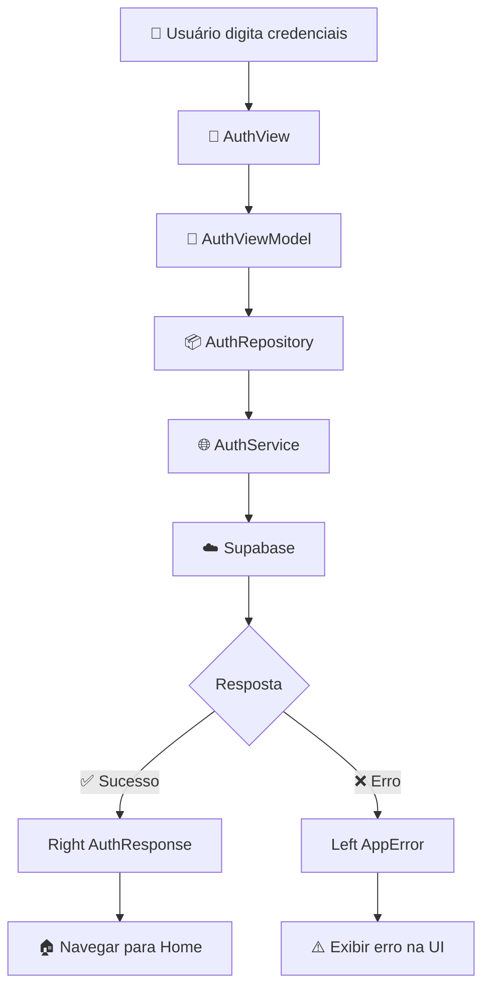

# 📲 App4 🍽️ Receitas – Eu Amo Cozinhar


> **Um aplicativo completo de receitas com autenticação, favoritos e arquitetura limpa usando Flutter + Supabase**

<table align="center">
  <tr>
    <td align="center" width="100%" colspan="2">
      
      <br>
      <em>🍽️ Evolução visual do projeto - Antes e depois da animação do logo</em>
    </td>
  </tr>
</table>

---

## 📑 **Índice**

1. [🎯 Visão Geral](#-visão-geral)
2. [🏗️ Arquitetura](#️-arquitetura)
3. [🔐 Sistema de Autenticação](#-sistema-de-autenticação)
4. [🍽️ Funcionalidades](#️-funcionalidades)
5. [🧪 Estratégia de Testes](#-estratégia-de-testes)
6. [🚀 Como Executar](#-como-executar)
7. [⚙️ Configuração](#️-configuração)
8. [📦 Dependências](#-dependências)
9. [✅ Status do Projeto](#-status-do-projeto)

---

## 🎯 **Visão Geral**

**App4 Receitas** é um aplicativo Flutter que demonstra a implementação de:

- ✅ **Autenticação completa** com Supabase
- ✅ **Arquitetura limpa** (Clean Architecture)
- ✅ **Gerenciamento de estado** reativo com GetX
- ✅ **Sistema de favoritos** persistente
- ✅ **Testes abrangentes** (unitários, widgets e integração)
- ✅ **UI moderna** com animações fluidas
- ✅ **Tratamento funcional de erros** com Either

---

## 🏗️ **Arquitetura**

O projeto segue os princípios da **Clean Architecture** organizada em camadas:

```
📱 UI Layer (Presentation)
├── Views (Telas) → auth_view.dart, recipes_view.dart, profile_view.dart
├── ViewModels (Lógica de apresentação) → auth_viewmodel.dart, recipes_viewmodel.dart
└── Widgets (Componentes reutilizáveis) → custom_bnb.dart, recipe_card.dart

💼 Domain Layer (Regras de negócio)
├── Models (Entidades) → recipe.dart, user_profile.dart
├── Repositories (Contratos) → auth_repository.dart, recipe_repository.dart
└── Use Cases (Casos de uso específicos)

🗄️ Data Layer (Dados)
├── Services (Comunicação externa) → auth_service.dart, recipe_service.dart
├── Repositories (Implementações) → Implementação dos contratos
└── Data Sources (Supabase, Cache local)

🔧 Infrastructure
├── DI (Injeção de dependência) → service_locator.dart
├── Routes (Navegação) → app_router.dart
└── Utils (Utilitários) → app_error.dart, env.dart
```

### **Fluxo de Dados**
```
UI → ViewModel → Repository → Service → Supabase
```

---

## 🔐 **Sistema de Autenticação**

### **Fluxo Completo do Login**



### **Tratamento de Erros**

O sistema mapeia erros específicos do Supabase para mensagens amigáveis:

| Erro do Supabase | Mensagem para o Usuário |
|------------------|-------------------------|
| `invalid_login_credentials` | "Credenciais inválidas. Verifique seu e-mail e senha." |
| `email_not_confirmed` | "E-mail não confirmado ainda. Verifique sua caixa de entrada." |
| `network_error` | "Falha na conexão. Tente novamente." |
| `generic_error` | "Erro inesperado. Tente novamente mais tarde." |

### **Por que Either?**

```dart
// ❌ Tratamento tradicional com exceções
try {
  final user = await authService.signIn(email, password);
  navigateToHome();
} catch (e) {
  showError(e.toString());
}

// ✅ Tratamento funcional com Either
final result = await authService.signIn(email, password);
result.fold(
  (error) => showError(error.message),
  (user) => navigateToHome(),
);
```

**Vantagens:**
- 🧠 **Tratamento explícito**: Você é obrigado a lidar com erros
- ❌ **Sem exceções soltas**: Erros são parte do tipo de retorno
- ✅ **Código mais limpo**: Fluxo de erro previsível

---

## 🍽️ **Funcionalidades**

### **Implementadas**
- ✅ **Autenticação**: Login, registro, logout
- ✅ **Listagem de receitas**: Busca todas as receitas do Supabase
- ✅ **Detalhes da receita**: Visualização completa com ingredientes
- ✅ **Sistema de favoritos**: Adicionar/remover favoritos persistentes
- ✅ **Perfil do usuário**: Gerenciamento de conta e avatar
- ✅ **Navegação**: Bottom navigation e drawer customizados
- ✅ **Temas**: Modo claro/escuro dinâmico
- ✅ **Animações**: Transições suaves entre telas

### **Fluxo das Receitas**
```
RecipesView → RecipesViewModel → RecipeRepository → RecipeService → Supabase
```

---

## 🧪 **Estratégia de Testes**

### **Estrutura Organizada**
```
test/
├── ui/
│   └── auth/
│       ├── auth_simple_test.dart      # Testes unitários rápidos
│       └── auth_view_widget_test.dart # Testes com mocks
integration_test/
└── app_test.dart                      # Testes E2E completos
```

### **Tipos de Teste**

#### **1. Testes Unitários** ⚡
- **Tempo**: ~5 segundos
- **Propósito**: Verificar widgets isolados
- **Comando**: `flutter test test/ui/auth/auth_simple_test.dart`

#### **2. Testes com Mocks** 🎭
- **Ferramentas**: Mockito + Build Runner
- **Propósito**: Testar com dependências simuladas
- **Setup**: `dart run build_runner build`

#### **3. Testes de Integração (E2E)** 🌐
- **Propósito**: Fluxo completo do usuário
- **Inclui**: Integração real com Supabase
- **Comando**: `flutter test integration_test/app_test.dart -d windows`

### **Cobertura de Testes**
- ✅ **UI Components**: Widgets e formulários
- ✅ **Authentication Flow**: Login e registro
- ✅ **Navigation**: Rotas e transições
- ✅ **State Management**: GetX controllers
- ✅ **Error Handling**: Tratamento de falhas

---

## 🚀 **Como Executar**

### **Pré-requisitos**
- Flutter 3.0+
- Dart 3.0+
- Conta no Supabase

### **1. Clonar o Repositório**
```bash
git clone https://github.com/Andrehlb/flutter_app4_receitas.git
cd flutter_app4_receitas
```

### **2. Instalar Dependências**
```bash
flutter pub get
```

### **3. Configurar Variáveis de Ambiente**
Criar arquivo `assets/.env`:
```env
SUPABASE_URL=sua_url_do_supabase
SUPABASE_ANON_KEY=sua_chave_anonima
```

### **4. Executar o Aplicativo**
```bash
# Desenvolvimento
flutter run

# Release
flutter run --release
```

### **5. Executar Testes**
```bash
# Todos os testes
flutter test

# Testes específicos
flutter test test/ui/auth/auth_simple_test.dart --reporter expanded

# Testes de integração
flutter test integration_test/app_test.dart -d windows

# Gerar mocks (quando necessário)
dart run build_runner build
```

---

## ⚙️ **Configuração**

### **Supabase Setup**
```dart
// Inicialização no main.dart
await Supabase.initialize(
  url: Env.supabaseUrl,
  anonKey: Env.supabaseAnonKey,
);
```

### **Injeção de Dependências (GetIt)**
```dart
void setupServiceLocator() {
  // Clients
  getIt.registerSingleton<SupabaseClient>(Supabase.instance.client);
  
  // Services
  getIt.registerLazySingleton<AuthService>(() => AuthService());
  getIt.registerLazySingleton<RecipeService>(() => RecipeService());
  
  // Repositories
  getIt.registerLazySingleton<AuthRepository>(() => AuthRepository());
  getIt.registerLazySingleton<RecipeRepository>(() => RecipeRepository());
  
  // ViewModels
  getIt.registerFactory<AuthViewModel>(() => AuthViewModel());
  getIt.registerFactory<RecipesViewModel>(() => RecipesViewModel());
}
```

### **Navegação (GoRouter)**
```dart
GoRouter(
  initialLocation: '/login',
  routes: [
    GoRoute(path: '/login', builder: (context, state) => AuthView()),
    ShellRoute(
      builder: (context, state, child) => BaseScreen(child: child),
      routes: [
        GoRoute(path: '/', builder: (context, state) => RecipesView()),
        GoRoute(path: '/recipe/:id', builder: (context, state) => RecipeDetailView(id: state.pathParameters['id']!)),
        GoRoute(path: '/favorites', builder: (context, state) => FavRecipesView()),
        GoRoute(path: '/profile', builder: (context, state) => ProfileView()),
      ],
    ),
  ],
);
```

---

## 📦 **Dependências**

### **Principais**
```yaml
dependencies:
  flutter:
    sdk: flutter
  supabase_flutter: ^2.9.1      # Backend as a Service
  either_dart: ^1.0.0           # Programação funcional
  get: ^4.7.2                   # Gerenciamento de estado
  get_it: ^8.2.0                # Injeção de dependência
  go_router: ^16.0.0            # Navegação declarativa
  google_fonts: ^6.3.0          # Fontes customizadas
  flutter_speed_dial: ^7.0.0    # FAB com múltiplas ações
  flutter_dotenv: ^5.2.1        # Variáveis de ambiente

dev_dependencies:
  flutter_test:
    sdk: flutter
  integration_test:
    sdk: flutter
  flutter_lints: ^5.0.0         # Análise estática
  mockito: ^5.4.4               # Mocks para testes
  build_runner: ^2.4.12         # Gerador de código
```

---

## ✅ **Status do Projeto**

### **Funcionalidades**
- [x] **Supabase** configurado e funcionando
- [x] **Autenticação** completa (login, registro, logout)
- [x] **Either** implementado para tratamento de erros
- [x] **Sistema de receitas** com CRUD completo
- [x] **Favoritos** persistentes funcionando
- [x] **Testes unitários** configurados ✅
- [x] **Testes de integração** implementados ✅
- [x] **Mocks** com Mockito funcionando ✅
- [x] **Arquitetura limpa** implementada ✅
- [ ] **Tratamento visual** aprimorado de erros
- [ ] **Cache local** para offline
- [ ] **Push notifications**
- [ ] **Busca avançada** de receitas

### **Qualidade do Código**
- [x] **Lint rules** configuradas
- [x] **Clean Architecture** implementada
- [x] **Injeção de dependência** com GetIt
- [x] **Programação funcional** com Either
- [x] **Testes automatizados** funcionando
- [x] **Documentação** completa

---

## 👥 **Créditos**

**Desenvolvido por:** [André Henrique](https://github.com/Andrehlb)

**Agradecimentos especiais:**
- **Professor Guilherme** - Orientação técnica
- **Equipe Venturus** - Oportunidade e suporte
- **Colegas de turma** - Colaboração e feedback

---

## 📄 **Licença**

Este projeto está sob licença MIT. Veja o arquivo [LICENSE](LICENSE) para mais detalhes.

---

**Feito com 💙 para aprendizado e evolução como desenvolvedor Flutter.**
### Processamento bem sucedido - comunicação Front com Back-end
- 📤 O **ViewModel chama** o método `signInWithPassword` e **envia** os para o `AuthRepository`
- 🔁 O **AuthRepository repassa** para o `AuthService`
### Processamento bem sucedido - Back-end
- 🌐 O **AuthService envia** ao Supabase (Back-end) usando `signInWithPassword`
- 📥 A resposta pode ser:
  - ✅ Sucesso → retorna `Right(AuthResponse)`
  - ❌ Erro → retorna `Left(AppError)`, este erro é tratado, exibe mensagens parecidas com "E-mail não confirmado" ou "Credenciais inválidas"

### 🏁 Fim

O fluxo termina com o **ViewModel** tratando o resultado com `fold`, exibindo mensagens para o usuário conforme o erro retornado.

---

### 🚨 Tratamento de Erros
Tipos de erro mapeados:
- ❌ invalid login credentials → "Oi! Estas credenciais estão inválidas. Dá uma conferida no teu e-mail e senha..."
- 📧 email not confirmed → "Oi! tudo bem? Olha, este e-mail não foi confirmado ainda..."
- 🌐 Erro de conexão → "Falha na conexão"
- ⚠️ Erro genérico → "Aconteceu um erro inesperado..."

---

#### Como funciona:

```markdown
// AuthService captura exceções específicas
on AuthException catch (e) {
    switch (e.message) {
        case 'invalid login credentials':
          return Left(AppError('Oi! Estas credenciais estão inválidas...'));
        case 'email not confirmed':
          return Left(AppError('Oi! tudo bem? Olha, este e-mail não foi confirmado...'));
        default:
          return Left(AppError('Erro de autenticação desconhecido'));
      }
  }
```
---

## ✅ FRONTEND vs BACKEND

| Papel         | Descrição                                                                 |
|---------------|---------------------------------------------------------------------------|
| **Frontend**  | Código que o usuário interage. Contém UI e lógica de interação com o app. |
| **Backend**   | Serviços externos como Supabase. Realizam a autenticação real de dados.   |

---

## 🔁 FLUXO COMPLETO DA AUTENTICAÇÃO

```

\[Usuário Digita] → auth\_view\.dart
↓
\[Envia ao ViewModel] → auth\_viewmodel.dart
↓
\[Chama AuthRepository] → auth\_repository.dart
↓
\[Chama AuthService] → auth\_service.dart
↓
\[Supabase (Back-end)] → valida email/senha
↓
\[Retorna Sucesso ou Erro] com Either
↓
\[ViewModel trata com fold] → isLeft/isRight
↓
\[Exibe feedback na UI]
````
### 🍽️ Funcionalidades de Receitas

 **Recursos implementados:**

- ✅ Listar receitas → Busca todas as receitas do Supabase
- ✅ Buscar receita por ID → Obtém detalhes específicos
- ✅ Sistema de favoritos → Adicionar/remover favoritos
- ✅ Perfil do usuário → Gerenciamento de conta

**Fluxo das receitas:**

```markdown
RecipesView → RecipesViewModel → RecipeRepository → RecipeService → Supabase
```
**Como funciona o mapeamento de dados:**
```markdown
// rawList vem do Supabase como List<Map<String, dynamic>>
[
  {
    "id": "1",
    "name": "Bolo de Chocolate",
    "ingredients": "chocolate, farinha, ovos"
  }
]

// Convertido para List<Recipe> usando Recipe.fromJson()
return rawList.map((m) => Recipe.fromJson(m)).toList();
```
## ⚙️ Configuração do Supabase

**Variáveis de ambiente (.env):**
```env
SUPABASE_URL=sua_url_aqui
SUPABASE_ANON_KEY=sua_chave_aqui
```

**Inicialização:**
```dart
await Supabase.initialize(
  url: Env.supabaseUrl,
  anonKey: Env.supabaseKey,
);
```

**Service Locator (GetIt):**

```dart
void setupServiceLocator() {
  getIt.registerLazySingleton<SupabaseClient>(
    () => Supabase.instance.client,
  );
  getIt.registerLazySingleton<AuthService>(() => AuthService());
  getIt.registerLazySingleton<AuthRepository>(() => AuthRepository());
}
```
### 🧪 Testes

**Estrutura de testes:**

```plaintext
test/
├── unit/
│   ├── repositories/
│   │   └── auth_repository_test.dart
│   ├── services/
│   └── viewmodels/
└── mocks/
    └── auth_repository_test.mocks.dart
```

**Configuração de Mock:**

```dart
@GenerateMocks([AuthService])
void main() {
  late MockAuthService mockAuthService;
  late AuthRepository authRepository;

  setUpAll(() {
    provideDummy<Either<AppError, AuthResponse>>(Right(AuthResponse()));
    provideDummy<Either<AppError, Map<String, dynamic>>>(Right({}));
    provideDummy<Either<AppError, void>>(Right(null));
  });
}
```
**Como rodar testes:**
```bash
flutter test
```

### 🧠 Resumo visual da função `signInWithPassword`

```dart
Future<Either<AppError, AuthResponse>> signInWithPassword(...) async {
  try {
    final res = await _supabaseClient.auth.signInWithPassword(...);
    return Right(res); // ✅ Sucesso
  } on AuthException catch (e) {
    return Left(AppError(_mapAuthError(e))); // ❌ Erro de login
  } catch (e) {
    return Left(AppError('Autenticação falhou. Tente novamente.')); // ⚠️ Erro genérico
  }
}
```

---

## 🧠 Resumo visual da função `signInWithPassword`

```dart
Future<Either<AppError, AuthResponse>> signInWithPassword(...) async {
  try {
    final res = await _supabaseClient.auth.signInWithPassword(...);
    return Right(res); // ✅ Sucesso
  } on AuthException catch (e) {
    return Left(AppError(_mapAuthError(e), e)); // ❌ Erro de login
  } catch (e) {
    return Left(AppError('Autenticação falhou. Tente novamente.', e)); // ⚠️ Erro genérico
  }
}
````

| Resultado | Significado | Tipo de dado |
| --------- | ----------- | ------------ |
| ✅ Right   | Sucesso     | AuthResponse |
| ❌ Left    | Falha       | AppError     |

---

## ✅ Quais scripts fazem parte do fluxo?

| Script                          | Local                    | Papel                                          |
| ------------------------------- | ------------------------ | ---------------------------------------------- |
| `auth_view.dart`                | `lib/ui/auth/`           | Tela de login com campos de e-mail e senha     |
| `auth_viewmodel.dart`           | `lib/ui/auth/`           | Recebe dados do front e chama o repositório    |
| `auth_repository.dart`          | `lib/data/repositories/` | Orquestra o acesso ao serviço de autenticação  |
| `auth_service.dart`             | `lib/data/services/`     | Chama o Supabase com os dados recebidos        |
| `app_error.dart`                | `lib/utils/`             | Modela e encapsula os erros de forma funcional |
| `main.dart` + `app_router.dart` | `lib/`                   | Inicia o app, define rotas e navegação         |

---

## 🧩 Por que usar `Either`?

| Vantagem                   | Explicação                                                                   |
| -------------------------- | ---------------------------------------------------------------------------- |
| 🧠 Tratamento funcional    | Você recebe Left (erro) ou Right (sucesso) e decide o que fazer com `fold()` |
| ❌ Evita exceções soltas    | O consumidor não precisa usar `try/catch`, pois o erro já vem encapsulado    |
| ✅ Melhor controle de fluxo | Você sabe sempre quando houve erro ou sucesso, sem depender de throw         |

---

## ✨ Exemplo de uso do resultado no ViewModel

```dart
final result = await authService.signInWithPassword(email, password);

result.fold(
  (error) => print('Erro: ${error.message}'), // Left
  (success) => print('Sucesso: ${success.user.email}'), // Right
);
```
---
## O que chama o quê?
```md
UI (Tela) 
  ↓ chama
ViewModel / Controller
  ↓ chama
AuthRepository  (lib/data/repositories/auth_repository.dart)
  ↓ chama
AuthService     (lib/data/services/auth_service.dart)
  ↓ chama
Supabase SDK    (supabase.auth.signInWithPassword)
```
---
```md
ViewModel → Repository → Service → Supabase
```
## 📦 Dependências principais

```yaml
dependencies:
  flutter:
    sdk: flutter
  supabase_flutter: ^2.9.1      # Backend como serviço
  either_dart: ^1.0.0           # Programação funcional
  get: ^4.7.2                   # Gerenciamento de estado
  get_it: ^8.2.0                # Injeção de dependência
  go_router: ^16.0.0            # Navegação
  google_fonts: ^6.3.0          # Fontes personalizadas
  flutter_speed_dial: ^7.0.0    # FAB com múltiplas ações
  flutter_dotenv: ^5.2.1        # Variáveis de ambiente

dev_dependencies:
  flutter_test:
    sdk: flutter
  flutter_lints: ^5.0.0         # Análise estática
```
---
### 📡 Envio e recebimento de dados

**O envio de dados para servidores (como login, cadastro, formulários) é gerenciado através da arquitetura em camadas:**

- Dados do usuário → ViewModels coletam os dados
- Processamento → Repositories organizam as chamadas
- Comunicação → Services fazem as requisições HTTP
- Persistência → Supabase armazena e valida os dados
---
### 🚀 Como rodar o projeto

#### Instalar dependências
```bash
flutter pub get
```

#### Rodar o app
```bash
flutter run
```

#### Rodar testes
```bash
flutter test
```

#### Gerar mocks para testes
```bash
dart run build_runner build
```
--- 

## 🧪 Testes

Este projeto implementa uma estratégia completa de testes, garantindo qualidade e confiabilidade do código.

### 📋 Estrutura de Testes

```
test/
├── ui/
│   └── auth/
│       ├── auth_simple_test.dart      ✅ Testes unitários básicos
│       └── auth_view_widget_test.dart  ✅ Testes com mocks
integration_test/
└── app_test.dart                      ✅ Testes de integração E2E
```

### 🎯 Tipos de Testes Implementados

#### 1. **Testes Unitários** 
- **Localização**: `test/ui/auth/auth_simple_test.dart`
- **Propósito**: Testar widgets isolados rapidamente
- **Resultado**: `✅ +3: All tests passed!` em ~5 segundos

```bash
# Executar testes unitários
flutter test test/ui/auth/auth_simple_test.dart
```

**Exemplo de resultado:**
```
00:00 +0: AuthView Tests Simples deve verificar se existe texto na tela
00:03 +1: AuthView Tests Simples deve verificar se botão existe  
00:03 +2: AuthView Tests Simples deve verificar campos de texto
00:05 +3: All tests passed!
```

#### 2. **Testes com Mocks**
- **Localização**: `test/ui/auth/auth_view_widget_test.dart`
- **Propósito**: Testar com dependências mockadas (AuthRepository, AuthService)
- **Ferramentas**: `mockito` + `build_runner`

```bash
# Gerar mocks automaticamente
dart run build_runner build

# Executar testes com mocks
flutter test test/ui/auth/auth_view_widget_test.dart
```

#### 3. **Testes de Integração (E2E)**
- **Localização**: `integration_test/app_test.dart`  
- **Propósito**: Testar fluxo completo do usuário
- **Inclui**: Autenticação real com Supabase

```bash
# Executar testes de integração
flutter test integration_test/app_test.dart -d windows
```

### 🛠️ Configuração de Testes

#### Dependências utilizadas:
```yaml
dev_dependencies:
  flutter_test:
    sdk: flutter
  integration_test:
    sdk: flutter
  mockito: ^5.4.4
  build_runner: ^2.4.12
```

#### Setup de Mocks:
1. **Anotação**: `@GenerateMocks([AuthRepository, AuthService])`
2. **Geração**: `dart run build_runner build`
3. **Uso**: `MockAuthRepository()`, `MockAuthService()`

#### Keys para Testes de Integração:
```dart
// Campos identificados para testes E2E
ValueKey('emailField')
ValueKey('passwordField') 
ValueKey('submitButton')
ValueKey('usernameField')
ValueKey('confirmPasswordField')
```

### 📊 Cobertura de Testes

- ✅ **UI Components**: Verificação de widgets e textos
- ✅ **Form Fields**: Teste de campos de entrada
- ✅ **Authentication Flow**: Fluxo de login/cadastro  
- ✅ **GetIt Integration**: Injeção de dependência nos testes
- ✅ **Supabase Integration**: Testes com backend real

### 🚀 Como Executar Todos os Testes

```bash
# Todos os testes unitários
flutter test

# Testes específicos
flutter test test/ui/auth/auth_simple_test.dart --reporter expanded

# Testes de integração (Windows)
flutter test integration_test/app_test.dart -d windows

# Com coverage (opcional)
flutter test --coverage
```

> 💡 **Dica**: Para comandos detalhados e solução de problemas, consulte [`TESTING.md`](TESTING.md)

### 📈 Benefícios Implementados

1. **🔄 CI/CD Ready**: Testes automatizados para pipeline
2. **🧪 Mock Strategy**: Isolamento de dependências externas  
3. **⚡ Performance**: Testes unitários extremamente rápidos
4. **🌐 Real Environment**: Integration tests com Supabase real
5. **📋 Maintainable**: Estrutura organizada e escalável

---

### 🔧 Configuração do ambiente

#### 1. Criar arquivo `.env` na pasta assets:

```env
SUPABASE_URL=sua_url_do_supabase
SUPABASE_ANON_KEY=sua_chave_anonima
```
#### 2. Configurar Supabase com as tabelas necessárias

#### 3. Executar `flutter pub get`
---

### ✅ Status

```md
- [x] Supabase configurado  
- [x] Autenticação com email/senha funcionando  
- [x] Either implementado  
- [x] ViewModel consome resultado corretamente  
- [x] Sistema de receitas implementado  
- [x] Favoritos funcionando  
- [x] Testes unitários configurados e funcionando ✅
- [x] Testes de integração implementados ✅
- [x] Mocks com mockito e build_runner ✅
- [x] Structure de testes organizada ✅
- [ ] Tratamento visual de erro e sucesso na interface  
- [ ] Implementar cache local  
- [ ] Cobertura de testes expandida
```
---
Feito com 💙 para estudos e evolução como desenvolvedor Flutter.
---
### 🙏 Agradecimentos:

- Professor Guilherme
- Raissa e demais meninas que vou pegar os nomes hahahaha para add aqui.
- Monitores, idem vou pergar os nomes para add aqui..
- Venturus, por me aceitarem, disponibilizarem esta oportunidade, pois sem o suporte de vocês, isto não seria possível.

