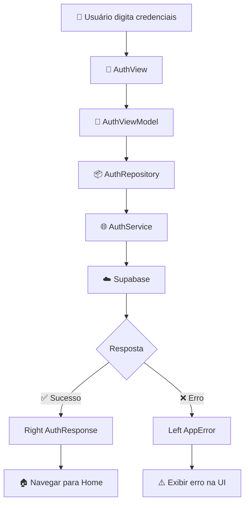

# 📲 App4 🍽️ Receitas – Eu Amo Cozinhar


> **Um aplicativo completo de receitas com autenticação, favoritos e arquitetura limpa usando Flutter + Supabase**

<table align="center">
  <tr>
    <td align="center" width="100%" colspan="2">
      
      <br>
      <em>🍽️ Evolução visual do projeto - Antes e depois da animação do logo</em>
    </td>
  </tr>
</table>

---

## 📑 **Índice**

1. [🎯 Visão Geral](#-visão-geral)
2. [🏗️ Arquitetura](#️-arquitetura)
3. [🔐 Sistema de Autenticação](#-sistema-de-autenticação)
4. [🍽️ Funcionalidades](#️-funcionalidades)
5. [🧪 Estratégia de Testes](#-estratégia-de-testes)
6. [🚀 Como Executar](#-como-executar)
7. [⚙️ Configuração](#️-configuração)
8. [📦 Dependências](#-dependências)
9. [✅ Status do Projeto](#-status-do-projeto)

---

## 🎯 **Visão Geral**

**App4 Receitas** é um aplicativo Flutter que demonstra a implementação de:

- ✅ **Autenticação completa** com Supabase
- ✅ **Arquitetura limpa** (Clean Architecture)
- ✅ **Gerenciamento de estado** reativo com GetX
- ✅ **Sistema de favoritos** persistente
- ✅ **Testes abrangentes** (unitários, widgets e integração)
- ✅ **UI moderna** com animações fluidas
- ✅ **Tratamento funcional de erros** com Either

---

## 🏗️ **Arquitetura**

O projeto segue os princípios da **Clean Architecture** organizada em camadas:

```
📱 UI Layer (Presentation)
├── Views (Telas) → auth_view.dart, recipes_view.dart, profile_view.dart
├── ViewModels (Lógica de apresentação) → auth_viewmodel.dart, recipes_viewmodel.dart
└── Widgets (Componentes reutilizáveis) → custom_bnb.dart, recipe_card.dart

💼 Domain Layer (Regras de negócio)
├── Models (Entidades) → recipe.dart, user_profile.dart
├── Repositories (Contratos) → auth_repository.dart, recipe_repository.dart
└── Use Cases (Casos de uso específicos)

🗄️ Data Layer (Dados)
├── Services (Comunicação externa) → auth_service.dart, recipe_service.dart
├── Repositories (Implementações) → Implementação dos contratos
└── Data Sources (Supabase, Cache local)

🔧 Infrastructure
├── DI (Injeção de dependência) → service_locator.dart
├── Routes (Navegação) → app_router.dart
└── Utils (Utilitários) → app_error.dart, env.dart
```

### **Fluxo de Dados**
```
UI → ViewModel → Repository → Service → Supabase
```

---

## 🔐 **Sistema de Autenticação**

### **Fluxo Completo do Login**



### **Tratamento de Erros**

O sistema mapeia erros específicos do Supabase para mensagens amigáveis:

| Erro do Supabase | Mensagem para o Usuário |
|------------------|-------------------------|
| `invalid_login_credentials` | "Credenciais inválidas. Verifique seu e-mail e senha." |
| `email_not_confirmed` | "E-mail não confirmado ainda. Verifique sua caixa de entrada." |
| `network_error` | "Falha na conexão. Tente novamente." |
| `generic_error` | "Erro inesperado. Tente novamente mais tarde." |

### **Por que Either?**

```dart
// ❌ Tratamento tradicional com exceções
try {
  final user = await authService.signIn(email, password);
  navigateToHome();
} catch (e) {
  showError(e.toString());
}

// ✅ Tratamento funcional com Either
final result = await authService.signIn(email, password);
result.fold(
  (error) => showError(error.message),
  (user) => navigateToHome(),
);
```

**Vantagens:**
- 🧠 **Tratamento explícito**: Você é obrigado a lidar com erros
- ❌ **Sem exceções soltas**: Erros são parte do tipo de retorno
- ✅ **Código mais limpo**: Fluxo de erro previsível

---

## 🍽️ **Funcionalidades**

### **Implementadas**
- ✅ **Autenticação**: Login, registro, logout
- ✅ **Listagem de receitas**: Busca todas as receitas do Supabase
- ✅ **Detalhes da receita**: Visualização completa com ingredientes
- ✅ **Sistema de favoritos**: Adicionar/remover favoritos persistentes
- ✅ **Perfil do usuário**: Gerenciamento de conta e avatar
- ✅ **Navegação**: Bottom navigation e drawer customizados
- ✅ **Temas**: Modo claro/escuro dinâmico
- ✅ **Animações**: Transições suaves entre telas

### **Fluxo das Receitas**
```
RecipesView → RecipesViewModel → RecipeRepository → RecipeService → Supabase
```

---

## 🧪 **Estratégia de Testes**

### **Estrutura Organizada**
```
test/
├── ui/
│   └── auth/
│       ├── auth_simple_test.dart      # Testes unitários rápidos
│       └── auth_view_widget_test.dart # Testes com mocks
integration_test/
└── app_test.dart                      # Testes E2E completos
```

### **Tipos de Teste**

#### **1. Testes Unitários** ⚡
- **Tempo**: ~5 segundos
- **Propósito**: Verificar widgets isolados
- **Comando**: `flutter test test/ui/auth/auth_simple_test.dart`

#### **2. Testes com Mocks** 🎭
- **Ferramentas**: Mockito + Build Runner
- **Propósito**: Testar com dependências simuladas
- **Setup**: `dart run build_runner build`

#### **3. Testes de Integração (E2E)** 🌐
- **Propósito**: Fluxo completo do usuário
- **Inclui**: Integração real com Supabase
- **Comando**: `flutter test integration_test/app_test.dart -d windows`

### **Cobertura de Testes**
- ✅ **UI Components**: Widgets e formulários
- ✅ **Authentication Flow**: Login e registro
- ✅ **Navigation**: Rotas e transições
- ✅ **State Management**: GetX controllers
- ✅ **Error Handling**: Tratamento de falhas

---

## 🚀 **Como Executar**

### **Pré-requisitos**
- Flutter 3.0+
- Dart 3.0+
- Conta no Supabase

### **1. Clonar o Repositório**
```bash
git clone https://github.com/Andrehlb/flutter_app4_receitas.git
cd flutter_app4_receitas
```

### **2. Instalar Dependências**
```bash
flutter pub get
```

### **3. Configurar Variáveis de Ambiente**
Criar arquivo `assets/.env`:
```env
SUPABASE_URL=sua_url_do_supabase
SUPABASE_ANON_KEY=sua_chave_anonima
```

### **4. Executar o Aplicativo**

#### **Windows (Desktop)**
```bash
# Desenvolvimento
flutter run -d windows

# Release
flutter run -d windows --release
```

#### **Android (Emulador/Dispositivo)**

**Pré-requisitos Android:**
- Android Studio instalado
- SDK do Android configurado (API 34 recomendado)
- Emulador Android ou dispositivo físico conectado

**Passos:**

1. **Verificar dispositivos disponíveis:**
```bash
flutter devices
```

2. **Criar/Iniciar emulador Android:**
```bash
# Listar emuladores disponíveis
flutter emulators

# Iniciar um emulador (substitua pelo nome do seu)
flutter emulators --launch Pixel_7_API_34
```

3. **Executar no Android:**
```bash
# Desenvolvimento (detecta automaticamente o dispositivo Android)
flutter run

# Especificar Android explicitamente
flutter run -d android

# Release
flutter run -d android --release
```

**📱 Configurar Emulador Android (se necessário):**
1. Abra **Android Studio**
2. Vá em **Tools** → **AVD Manager**
3. Clique em **Create Virtual Device**
4. Escolha **Phone** → **Pixel 7**
5. Selecione **API Level 34** (Android 14)
6. Clique em **▶️ Start** no emulador

#### **Web (Navegador)**
```bash
# Desenvolvimento
flutter run -d chrome

# Release
flutter run -d web --release
```

### **5. Executar Testes**
```bash
# Todos os testes
flutter test

# Testes específicos
flutter test test/ui/auth/auth_simple_test.dart --reporter expanded

# Testes de integração (Windows)
flutter test integration_test/app_test.dart -d windows

# Testes de integração (Android - emulador deve estar rodando)
flutter test integration_test/app_test.dart -d android

# Gerar mocks (quando necessário)
dart run build_runner build
```

---

## ⚙️ **Configuração**

### **Supabase Setup**
```dart
// Inicialização no main.dart
await Supabase.initialize(
  url: Env.supabaseUrl,
  anonKey: Env.supabaseAnonKey,
);
```

### **Injeção de Dependências (GetIt)**
```dart
void setupServiceLocator() {
  // Clients
  getIt.registerSingleton<SupabaseClient>(Supabase.instance.client);
  
  // Services
  getIt.registerLazySingleton<AuthService>(() => AuthService());
  getIt.registerLazySingleton<RecipeService>(() => RecipeService());
  
  // Repositories
  getIt.registerLazySingleton<AuthRepository>(() => AuthRepository());
  getIt.registerLazySingleton<RecipeRepository>(() => RecipeRepository());
  
  // ViewModels
  getIt.registerFactory<AuthViewModel>(() => AuthViewModel());
  getIt.registerFactory<RecipesViewModel>(() => RecipesViewModel());
}
```

### **Navegação (GoRouter)**
```dart
GoRouter(
  initialLocation: '/login',
  routes: [
    GoRoute(path: '/login', builder: (context, state) => AuthView()),
    ShellRoute(
      builder: (context, state, child) => BaseScreen(child: child),
      routes: [
        GoRoute(path: '/', builder: (context, state) => RecipesView()),
        GoRoute(path: '/recipe/:id', builder: (context, state) => RecipeDetailView(id: state.pathParameters['id']!)),
        GoRoute(path: '/favorites', builder: (context, state) => FavRecipesView()),
        GoRoute(path: '/profile', builder: (context, state) => ProfileView()),
      ],
    ),
  ],
);
```

---

## 📦 **Dependências**

### **Principais**
```yaml
dependencies:
  flutter:
    sdk: flutter
  supabase_flutter: ^2.9.1      # Backend as a Service
  either_dart: ^1.0.0           # Programação funcional
  get: ^4.7.2                   # Gerenciamento de estado
  get_it: ^8.2.0                # Injeção de dependência
  go_router: ^16.0.0            # Navegação declarativa
  google_fonts: ^6.3.0          # Fontes customizadas
  flutter_speed_dial: ^7.0.0    # FAB com múltiplas ações
  flutter_dotenv: ^5.2.1        # Variáveis de ambiente

dev_dependencies:
  flutter_test:
    sdk: flutter
  integration_test:
    sdk: flutter
  flutter_lints: ^5.0.0         # Análise estática
  mockito: ^5.4.4               # Mocks para testes
  build_runner: ^2.4.12         # Gerador de código
```

---

## 🔧 **Solução de Problemas**

### **Problemas Comuns no Android**

#### **❌ "No connected devices"**
```bash
# Verificar se o emulador está rodando
flutter devices

# Se não aparecer nenhum dispositivo Android:
# 1. Abra Android Studio
# 2. Tools → AVD Manager
# 3. Inicie um emulador
```

#### **❌ "Android SDK not found"**
```bash
# Verificar configuração do Flutter
flutter doctor

# Se Android SDK não estiver configurado:
# 1. Instale Android Studio
# 2. Configure SDK Manager
# 3. Adicione ANDROID_HOME nas variáveis de ambiente
```

#### **❌ "Gradle build failed"**
```bash
# Limpar build do Android
flutter clean
flutter pub get
cd android
./gradlew clean
cd ..
flutter run -d android
```

#### **❌ "App não conecta com Supabase no Android"**
- ✅ Verificar se o arquivo `.env` está na pasta `assets/`
- ✅ Confirmar se as URLs no `.env` estão corretas
- ✅ Verificar permissões de internet no `android/app/src/main/AndroidManifest.xml`:
```xml
<uses-permission android:name="android.permission.INTERNET" />
```

### **Comandos Úteis para Debug**

```bash
# Verificar configuração completa
flutter doctor -v

# Listar todos os dispositivos e emuladores
flutter devices -v

# Executar com logs detalhados
flutter run -d android -v

# Verificar logs do dispositivo
flutter logs

# Hot reload manual (durante execução)
# Pressione 'r' no terminal

# Hot restart manual (durante execução)  
# Pressione 'R' no terminal
```

---

## ✅ **Status do Projeto**

### **Funcionalidades**
- [x] **Supabase** configurado e funcionando
- [x] **Autenticação** completa (login, registro, logout)
- [x] **Either** implementado para tratamento de erros
- [x] **Sistema de receitas** com CRUD completo
- [x] **Favoritos** persistentes funcionando
- [x] **Testes unitários** configurados ✅
- [x] **Testes de integração** implementados ✅
- [x] **Mocks** com Mockito funcionando ✅
- [x] **Arquitetura limpa** implementada ✅
- [ ] **Tratamento visual** aprimorado de erros
- [ ] **Cache local** para offline
- [ ] **Push notifications**
- [ ] **Busca avançada** de receitas

### **Qualidade do Código**
- [x] **Lint rules** configuradas
- [x] **Clean Architecture** implementada
- [x] **Injeção de dependência** com GetIt
- [x] **Programação funcional** com Either
- [x] **Testes automatizados** funcionando
- [x] **Documentação** completa

---

## 👥 **Créditos**

**Desenvolvido por:** [André Luiz Barbosa](https://github.com/Andrehlb)

**Agradecimentos especiais:**
- **Professor Guilherme** - Orientação técnica
- **Equipe Venturus** - Oportunidade e suporte
- **Colegas de turma** - Colaboração e feedback

---

## 📄 **Licença**

Este projeto está sob licença MIT. Veja o arquivo [LICENSE](LICENSE) para mais detalhes.

---

**Feito com 💙 para aprendizado e evolução como desenvolvedor Flutter.**
