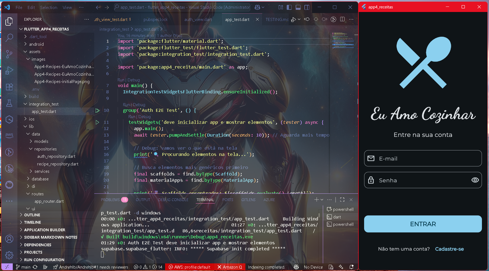
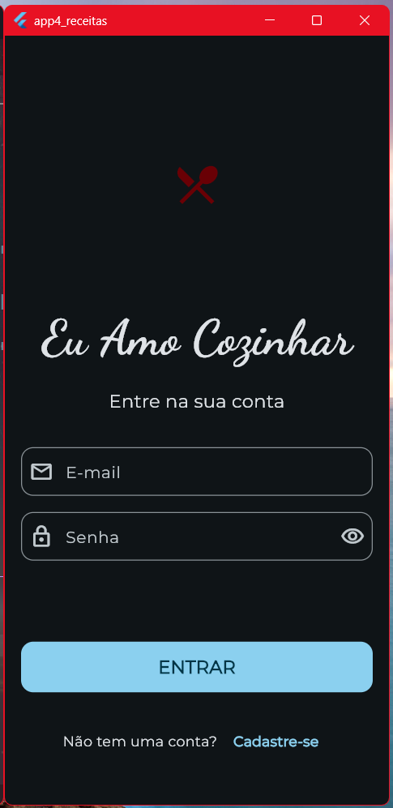

# 📲 App4 🍽️ Receitas – Autenticação com Supabase


* ✅ Onde tudo começa e termina
* ✅ Fluxo completo da autenticação
* ✅ Diferença entre front-end e back-end
* ✅ Scripts envolvidos
* ✅ Testes unitários e de integração implementados
* ✅ Resumo visual e técnico

---
Este é um projeto de um aplicativo de receitas e sistemas de favoritos, usando Dart-Flutter, com uma arquitetura limpa, com Supabase.<br>
--- 

<table align="center">
  <tr>
    <td align="center" width="50%">
      
      <br>
      <em>🍽️ Ícone Grande (Início da animação)</em>
    </td>
    <td align="center" width="50%">
      
      <br>
      <em>🔄 Ícone Pequeno (Final da animação)</em>
    </td>
  </tr>
</table>

<p align="center">
  <strong>⚡ Animação fluída do garfo e faca com rotação e mudança de tamanho</strong>
</p>

---
Este projeto está em camadas, com foco em boas práticas e uso de Vários pacotes, como o `either_dart` para tratamento funcional de sucesso/erro.
---
```md
📱 UI Layer (Presentation)
├── Views (Telas) → auth_view.dart, recipes_view.dart
├── ViewModels (Lógica de apresentação) → auth_viewmodel.dart
└── Widgets (Componentes reutilizáveis) → custom_drawer.dart

💼 Domain Layer (Regras de negócio)
├── Models (Entidades) → recipe.dart, user_profile.dart
├── Repositories (Contratos) → auth_repository.dart
└── Use Cases (Regras específicas)

🗄️ Data Layer (Dados)
├── Services (Comunicação externa) → auth_service.dart
├── Repositories (Implementações) → recipe_repository.dart
└── Data Sources (Supabase, Cache, etc.)

🔧 Infrastructure
├── DI (Injeção de dependência) → service_locator.dart
├── Routes (Navegação) → app_router.dart
└── Utils (Utilitários) → app_error.dart
```
---
Aqui é possível observar e aprender como organizar a lógica de autenticação com boas práticas e um fluxo robusto de login.
---

### ✅ Onde tudo começa e termina?

### Início - Front-end
- 👤 O **usuário digita** e-mail e senha na tela de login (`auth_view.dart`) e clica/toca em entrar
### Processamento bem sucedido - comunicação Front com Back-end
- 📤 O **ViewModel chama** o método `signInWithPassword` e **envia** os para o `AuthRepository`
- 🔁 O **AuthRepository repassa** para o `AuthService`
### Processamento bem sucedido - Back-end
- 🌐 O **AuthService envia** ao Supabase (Back-end) usando `signInWithPassword`
- 📥 A resposta pode ser:
  - ✅ Sucesso → retorna `Right(AuthResponse)`
  - ❌ Erro → retorna `Left(AppError)`, este erro é tratado, exibe mensagens parecidas com "E-mail não confirmado" ou "Credenciais inválidas"

### 🏁 Fim

O fluxo termina com o **ViewModel** tratando o resultado com `fold`, exibindo mensagens para o usuário conforme o erro retornado.

---

### 🚨 Tratamento de Erros
Tipos de erro mapeados:
- ❌ invalid login credentials → "Oi! Estas credenciais estão inválidas. Dá uma conferida no teu e-mail e senha..."
- 📧 email not confirmed → "Oi! tudo bem? Olha, este e-mail não foi confirmado ainda..."
- 🌐 Erro de conexão → "Falha na conexão"
- ⚠️ Erro genérico → "Aconteceu um erro inesperado..."

---

#### Como funciona:

```markdown
// AuthService captura exceções específicas
on AuthException catch (e) {
    switch (e.message) {
        case 'invalid login credentials':
          return Left(AppError('Oi! Estas credenciais estão inválidas...'));
        case 'email not confirmed':
          return Left(AppError('Oi! tudo bem? Olha, este e-mail não foi confirmado...'));
        default:
          return Left(AppError('Erro de autenticação desconhecido'));
      }
  }
```
---

## ✅ FRONTEND vs BACKEND

| Papel         | Descrição                                                                 |
|---------------|---------------------------------------------------------------------------|
| **Frontend**  | Código que o usuário interage. Contém UI e lógica de interação com o app. |
| **Backend**   | Serviços externos como Supabase. Realizam a autenticação real de dados.   |

---

## 🔁 FLUXO COMPLETO DA AUTENTICAÇÃO

```

\[Usuário Digita] → auth\_view\.dart
↓
\[Envia ao ViewModel] → auth\_viewmodel.dart
↓
\[Chama AuthRepository] → auth\_repository.dart
↓
\[Chama AuthService] → auth\_service.dart
↓
\[Supabase (Back-end)] → valida email/senha
↓
\[Retorna Sucesso ou Erro] com Either
↓
\[ViewModel trata com fold] → isLeft/isRight
↓
\[Exibe feedback na UI]
````
### 🍽️ Funcionalidades de Receitas

 **Recursos implementados:**

- ✅ Listar receitas → Busca todas as receitas do Supabase
- ✅ Buscar receita por ID → Obtém detalhes específicos
- ✅ Sistema de favoritos → Adicionar/remover favoritos
- ✅ Perfil do usuário → Gerenciamento de conta

**Fluxo das receitas:**

```markdown
RecipesView → RecipesViewModel → RecipeRepository → RecipeService → Supabase
```
**Como funciona o mapeamento de dados:**
```markdown
// rawList vem do Supabase como List<Map<String, dynamic>>
[
  {
    "id": "1",
    "name": "Bolo de Chocolate",
    "ingredients": "chocolate, farinha, ovos"
  }
]

// Convertido para List<Recipe> usando Recipe.fromJson()
return rawList.map((m) => Recipe.fromJson(m)).toList();
```
## ⚙️ Configuração do Supabase

**Variáveis de ambiente (.env):**
```env
SUPABASE_URL=sua_url_aqui
SUPABASE_ANON_KEY=sua_chave_aqui
```

**Inicialização:**
```dart
await Supabase.initialize(
  url: Env.supabaseUrl,
  anonKey: Env.supabaseKey,
);
```

**Service Locator (GetIt):**

```dart
void setupServiceLocator() {
  getIt.registerLazySingleton<SupabaseClient>(
    () => Supabase.instance.client,
  );
  getIt.registerLazySingleton<AuthService>(() => AuthService());
  getIt.registerLazySingleton<AuthRepository>(() => AuthRepository());
}
```
### 🧪 Testes

**Estrutura de testes:**

```plaintext
test/
├── unit/
│   ├── repositories/
│   │   └── auth_repository_test.dart
│   ├── services/
│   └── viewmodels/
└── mocks/
    └── auth_repository_test.mocks.dart
```

**Configuração de Mock:**

```dart
@GenerateMocks([AuthService])
void main() {
  late MockAuthService mockAuthService;
  late AuthRepository authRepository;

  setUpAll(() {
    provideDummy<Either<AppError, AuthResponse>>(Right(AuthResponse()));
    provideDummy<Either<AppError, Map<String, dynamic>>>(Right({}));
    provideDummy<Either<AppError, void>>(Right(null));
  });
}
```
**Como rodar testes:**
```bash
flutter test
```

### 🧠 Resumo visual da função `signInWithPassword`

```dart
Future<Either<AppError, AuthResponse>> signInWithPassword(...) async {
  try {
    final res = await _supabaseClient.auth.signInWithPassword(...);
    return Right(res); // ✅ Sucesso
  } on AuthException catch (e) {
    return Left(AppError(_mapAuthError(e))); // ❌ Erro de login
  } catch (e) {
    return Left(AppError('Autenticação falhou. Tente novamente.')); // ⚠️ Erro genérico
  }
}
```

---

## 🧠 Resumo visual da função `signInWithPassword`

```dart
Future<Either<AppError, AuthResponse>> signInWithPassword(...) async {
  try {
    final res = await _supabaseClient.auth.signInWithPassword(...);
    return Right(res); // ✅ Sucesso
  } on AuthException catch (e) {
    return Left(AppError(_mapAuthError(e), e)); // ❌ Erro de login
  } catch (e) {
    return Left(AppError('Autenticação falhou. Tente novamente.', e)); // ⚠️ Erro genérico
  }
}
````

| Resultado | Significado | Tipo de dado |
| --------- | ----------- | ------------ |
| ✅ Right   | Sucesso     | AuthResponse |
| ❌ Left    | Falha       | AppError     |

---

## ✅ Quais scripts fazem parte do fluxo?

| Script                          | Local                    | Papel                                          |
| ------------------------------- | ------------------------ | ---------------------------------------------- |
| `auth_view.dart`                | `lib/ui/auth/`           | Tela de login com campos de e-mail e senha     |
| `auth_viewmodel.dart`           | `lib/ui/auth/`           | Recebe dados do front e chama o repositório    |
| `auth_repository.dart`          | `lib/data/repositories/` | Orquestra o acesso ao serviço de autenticação  |
| `auth_service.dart`             | `lib/data/services/`     | Chama o Supabase com os dados recebidos        |
| `app_error.dart`                | `lib/utils/`             | Modela e encapsula os erros de forma funcional |
| `main.dart` + `app_router.dart` | `lib/`                   | Inicia o app, define rotas e navegação         |

---

## 🧩 Por que usar `Either`?

| Vantagem                   | Explicação                                                                   |
| -------------------------- | ---------------------------------------------------------------------------- |
| 🧠 Tratamento funcional    | Você recebe Left (erro) ou Right (sucesso) e decide o que fazer com `fold()` |
| ❌ Evita exceções soltas    | O consumidor não precisa usar `try/catch`, pois o erro já vem encapsulado    |
| ✅ Melhor controle de fluxo | Você sabe sempre quando houve erro ou sucesso, sem depender de throw         |

---

## ✨ Exemplo de uso do resultado no ViewModel

```dart
final result = await authService.signInWithPassword(email, password);

result.fold(
  (error) => print('Erro: ${error.message}'), // Left
  (success) => print('Sucesso: ${success.user.email}'), // Right
);
```
---
## O que chama o quê?
```md
UI (Tela) 
  ↓ chama
ViewModel / Controller
  ↓ chama
AuthRepository  (lib/data/repositories/auth_repository.dart)
  ↓ chama
AuthService     (lib/data/services/auth_service.dart)
  ↓ chama
Supabase SDK    (supabase.auth.signInWithPassword)
```
---
```md
ViewModel → Repository → Service → Supabase
```
## 📦 Dependências principais

```yaml
dependencies:
  flutter:
    sdk: flutter
  supabase_flutter: ^2.9.1      # Backend como serviço
  either_dart: ^1.0.0           # Programação funcional
  get: ^4.7.2                   # Gerenciamento de estado
  get_it: ^8.2.0                # Injeção de dependência
  go_router: ^16.0.0            # Navegação
  google_fonts: ^6.3.0          # Fontes personalizadas
  flutter_speed_dial: ^7.0.0    # FAB com múltiplas ações
  flutter_dotenv: ^5.2.1        # Variáveis de ambiente

dev_dependencies:
  flutter_test:
    sdk: flutter
  flutter_lints: ^5.0.0         # Análise estática
```
---
### 📡 Envio e recebimento de dados

**O envio de dados para servidores (como login, cadastro, formulários) é gerenciado através da arquitetura em camadas:**

- Dados do usuário → ViewModels coletam os dados
- Processamento → Repositories organizam as chamadas
- Comunicação → Services fazem as requisições HTTP
- Persistência → Supabase armazena e valida os dados
---
### 🚀 Como rodar o projeto

#### Instalar dependências
```bash
flutter pub get
```

#### Rodar o app
```bash
flutter run
```

#### Rodar testes
```bash
flutter test
```

#### Gerar mocks para testes
```bash
dart run build_runner build
```
--- 

## 🧪 Testes

Este projeto implementa uma estratégia completa de testes, garantindo qualidade e confiabilidade do código.

### 📋 Estrutura de Testes

```
test/
├── ui/
│   └── auth/
│       ├── auth_simple_test.dart      ✅ Testes unitários básicos
│       └── auth_view_widget_test.dart  ✅ Testes com mocks
integration_test/
└── app_test.dart                      ✅ Testes de integração E2E
```

### 🎯 Tipos de Testes Implementados

#### 1. **Testes Unitários** 
- **Localização**: `test/ui/auth/auth_simple_test.dart`
- **Propósito**: Testar widgets isolados rapidamente
- **Resultado**: `✅ +3: All tests passed!` em ~5 segundos

```bash
# Executar testes unitários
flutter test test/ui/auth/auth_simple_test.dart
```

**Exemplo de resultado:**
```
00:00 +0: AuthView Tests Simples deve verificar se existe texto na tela
00:03 +1: AuthView Tests Simples deve verificar se botão existe  
00:03 +2: AuthView Tests Simples deve verificar campos de texto
00:05 +3: All tests passed!
```

#### 2. **Testes com Mocks**
- **Localização**: `test/ui/auth/auth_view_widget_test.dart`
- **Propósito**: Testar com dependências mockadas (AuthRepository, AuthService)
- **Ferramentas**: `mockito` + `build_runner`

```bash
# Gerar mocks automaticamente
dart run build_runner build

# Executar testes com mocks
flutter test test/ui/auth/auth_view_widget_test.dart
```

#### 3. **Testes de Integração (E2E)**
- **Localização**: `integration_test/app_test.dart`  
- **Propósito**: Testar fluxo completo do usuário
- **Inclui**: Autenticação real com Supabase

```bash
# Executar testes de integração
flutter test integration_test/app_test.dart -d windows
```

### 🛠️ Configuração de Testes

#### Dependências utilizadas:
```yaml
dev_dependencies:
  flutter_test:
    sdk: flutter
  integration_test:
    sdk: flutter
  mockito: ^5.4.4
  build_runner: ^2.4.12
```

#### Setup de Mocks:
1. **Anotação**: `@GenerateMocks([AuthRepository, AuthService])`
2. **Geração**: `dart run build_runner build`
3. **Uso**: `MockAuthRepository()`, `MockAuthService()`

#### Keys para Testes de Integração:
```dart
// Campos identificados para testes E2E
ValueKey('emailField')
ValueKey('passwordField') 
ValueKey('submitButton')
ValueKey('usernameField')
ValueKey('confirmPasswordField')
```

### 📊 Cobertura de Testes

- ✅ **UI Components**: Verificação de widgets e textos
- ✅ **Form Fields**: Teste de campos de entrada
- ✅ **Authentication Flow**: Fluxo de login/cadastro  
- ✅ **GetIt Integration**: Injeção de dependência nos testes
- ✅ **Supabase Integration**: Testes com backend real

### 🚀 Como Executar Todos os Testes

```bash
# Todos os testes unitários
flutter test

# Testes específicos
flutter test test/ui/auth/auth_simple_test.dart --reporter expanded

# Testes de integração (Windows)
flutter test integration_test/app_test.dart -d windows

# Com coverage (opcional)
flutter test --coverage
```

> 💡 **Dica**: Para comandos detalhados e solução de problemas, consulte [`TESTING.md`](TESTING.md)

### 📈 Benefícios Implementados

1. **🔄 CI/CD Ready**: Testes automatizados para pipeline
2. **🧪 Mock Strategy**: Isolamento de dependências externas  
3. **⚡ Performance**: Testes unitários extremamente rápidos
4. **🌐 Real Environment**: Integration tests com Supabase real
5. **📋 Maintainable**: Estrutura organizada e escalável

---

### 🔧 Configuração do ambiente

#### 1. Criar arquivo `.env` na pasta assets:

```env
SUPABASE_URL=sua_url_do_supabase
SUPABASE_ANON_KEY=sua_chave_anonima
```
#### 2. Configurar Supabase com as tabelas necessárias

#### 3. Executar `flutter pub get`
---

### ✅ Status

```md
- [x] Supabase configurado  
- [x] Autenticação com email/senha funcionando  
- [x] Either implementado  
- [x] ViewModel consome resultado corretamente  
- [x] Sistema de receitas implementado  
- [x] Favoritos funcionando  
- [x] Testes unitários configurados e funcionando ✅
- [x] Testes de integração implementados ✅
- [x] Mocks com mockito e build_runner ✅
- [x] Structure de testes organizada ✅
- [ ] Tratamento visual de erro e sucesso na interface  
- [ ] Implementar cache local  
- [ ] Cobertura de testes expandida
```
---
Feito com 💙 para estudos e evolução como desenvolvedor Flutter.
---
### 🙏 Agradecimentos:

- Professor Guilherme
- Raissa e demais meninas que vou pegar os nomes hahahaha para add aqui.
- Monitores, idem vou pergar os nomes para add aqui..
- Venturus, por me aceitarem, disponibilizarem esta oportunidade, pois sem o suporte de vocês, isto não seria possível.

